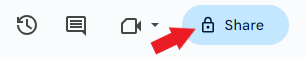
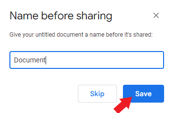
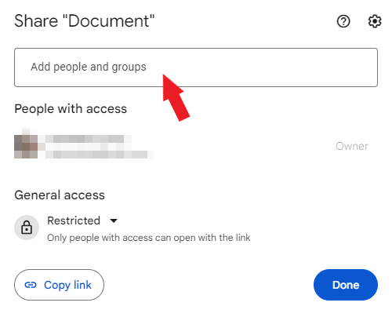
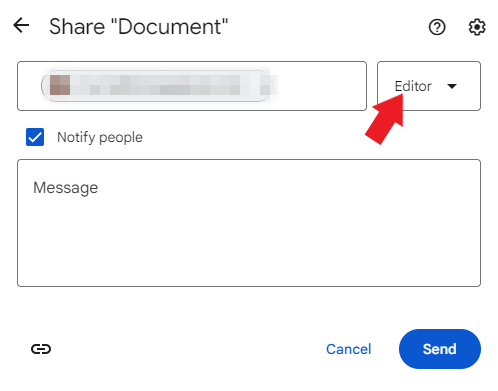
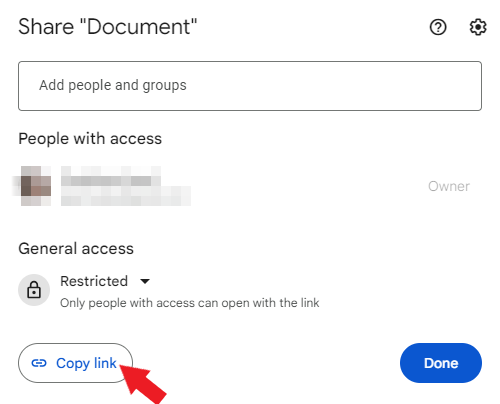

## How to manage access in Google Docs    

There are 2 methods to manage access in Google Docs.    

#### Method 1. If you know the person’s email    

1. Click **Share**.    

        

2. Name the document before sharing if needed and click **Save**.    

        

3.  In the field, type the **email** of the person you want to share the document with. If the person is in your contacts, you may type the **name**.     

     

4. To select the **access level**, click the **dropdown list**.    

    In Google Docs, there are 3 levels of access:        
    **Editor** can edit the document.    
    **Viewer** can only view the document.    
    **Commenter** can view the document and leave comments.    

        
  
5. Select the **Notify people** checkbox if necessary and click **Send**.   

#### Method 2. If you don’t know the person’s email   

1. Click **Share**.

        

2. Name the document before sharing if needed and click **Save**.    

           

3. Select the **access level**:        

    3.1. **Restricted** — only people with access can open with a link.    

    3.2. **General** — have three options:    

    + Editor can edit the document.    

    +  Viewer can only view the document.    

    + Commenter can view the document and leave comments.   

4. Click **Copy link**.    

            

5. Click **Done**.   

6. Share the **link** with a person by email or message.
    

