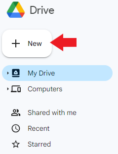
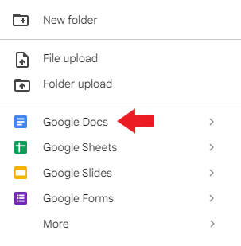

## How to create a document in Google Docs    

There are two methods to create a document in Google Docs.    

Method 1    

1. Open your Google Drive.    

2. Click +**New**.    

       
3. Point to **Google Docs** and select **Blank document** or **From a template**.    
        

Method 2    

1. On your device, navigate to [https://docs.google.com](https://docs.google.com/).    

2. Select **Blank** to create a blank document or select one of the necessary **templates**.

