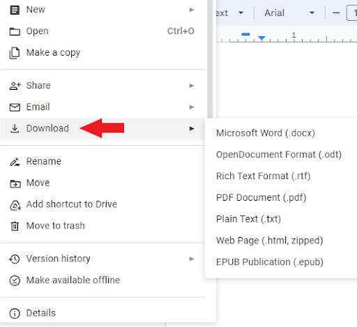

## How to download a file

To download a file:    

1. Open a file in Google Docs.    

2. Click **File**.    

        

3. Point to **Download** and select the required type of the document.    

        

4. In the open window, select a folder to save and click **Save**.  