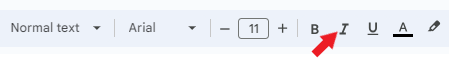

## How to format the text    

To format the text:    

1. Select the text you want to format. To select a single word, double-click it. To select a line of the text, click to the left of it.    

2. With the **toolbar**, you can change the font, font size, font color, make the text bold, italic, underline, or highlight color.    
  
        

#### To change the heading
 
 1. Click the **heading** dropdown list.    

    

2. Select the heading you want.   

#### To change the font    

1. Click the **Font** dropdown list.    

        

2. Select the font you want.    

#### To change the font size

1. Click **Font size**.    

        

2. Select the font size you want.    

#### To make the text bold    

There are some methods to make the text bold:    

* Click **Bold**.    
             
* Press **Ctrl+B**.    

* Click **Format > Text > Bold**.    

         

#### To make the text italic

There are some methods to make the text italic:    

* Click **Italic**.    
         
    
* Press **Ctrl+I**.    

* Click **Format > Text > Italic**.    
    
         
    

#### To underline the text

There are some methods to underline the text:    

* Click **Underline**.    
         
     
* Press **Ctrl+U**. 

* Click **Format > Text > Underline**.    

         

#### To change the text color    

1. Click **Text color**.    

         

2. Select the color you want.    

#### To highlight the text    

1. Click **Highlight color**.   

         

2. Select the color you want.

