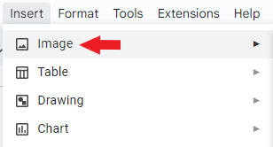
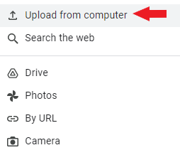
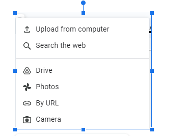
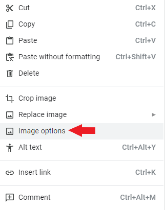
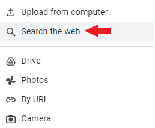

## How to insert different types of content

#### How to insert the image from the computer 

To insert the image from the computer:   

1. Open the necessary document in Google Docs.

2. Click **Insert**.    

    

3. In the **Insert** menu, click **Image**.    

    

4. Click **Upload from computer**.    

    

5. In the open window, double-click the image or click the image, and click the **Open** button.    

6. To resize the image, click the image. On the image border, hold the pointer over one of the blue squares, drag the pointer ⤡ to make the image larger or smaller.  

    

7. Wrap the text if needed. Right-click the image and then click **Image options**.   

    

8. In the sidebar, click **Text Wrapping** and click the necessary style.    

    

#### How to insert the image from the web in Google Docs    

To insert the image from the web:   

1. Open the necessary document in Google Docs.

2. Click **Insert**.    

    

3. In the **Insert** menu, click **Image**.    

    

4. Click **Search the web**.    

    

5. Type in the searchbox what you want to find and press **Enter**.    

    

6. Select the image and click the **Insert** button.    

7. To resize the image, click the image. On the image border, hold the pointer over one of the blue squares, drag the pointer ⤡ to make the image larger or smaller.   

    

8. Wrap the text if needed. Right-click the image and then click **Image options**.   

    

9. In the sidebar, click **Text Wrapping** and click the necessary style.    

    

#### How to insert the table

To  insert the table:

1. Open the necessary document in Google Docs.

2. Click **Insert**.    

    

3. Click **Table** and select the number of rows and columns or use table templates.

