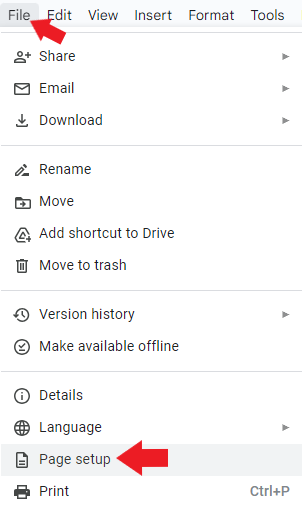

## How to manage the page settings

To manage the page settings:    

1. Open a file in Google Docs.    

2. Click **File** and select **Page setup**.    

        

3. If the pageless format is selected, click **Pages**. Select the required settings. Click **OK**.    

!!! Abstract "Note"

    If you click **Pageless**, you can only set the **Background color**. If your document has certain elements, such as headers and footers, or watermarks, and you switch it to **Pageless**, you won’t be able to see those elements. If you switch the document back to **Pages**, you can see those elements again.