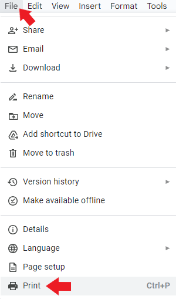

## How to print a file

There are two methods to print a file.

#### Method 1

1. Open a file in Google Docs.    

2. Click **File** and select **Print**.    

    

3. In the open window, select the required settings and click **Print**.    

!!! Abstract "Note"    

    For more print settings, click **More Settings**.    

#### Method 2

1. Click **Print** icon or press **Ctrl+P**.

    

2. In the open window, select the required settings and click **Print**.    

